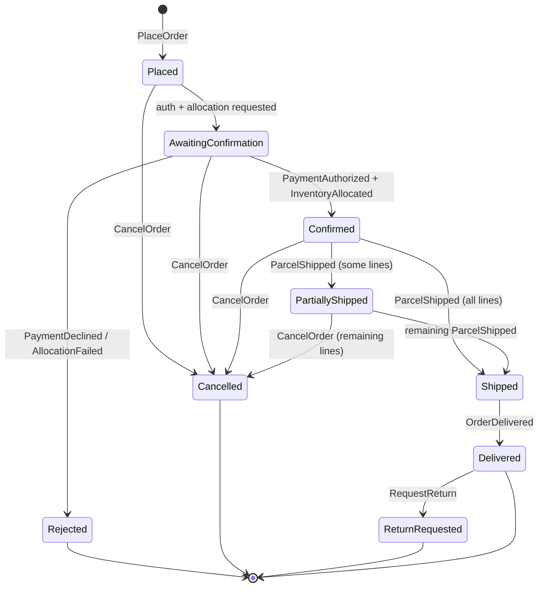
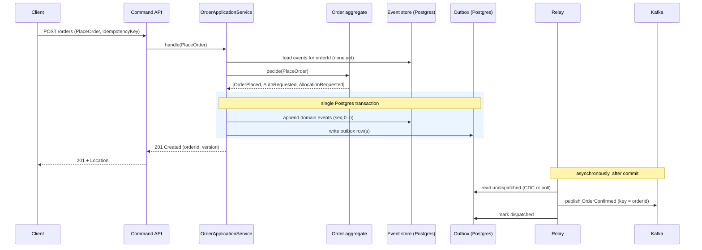
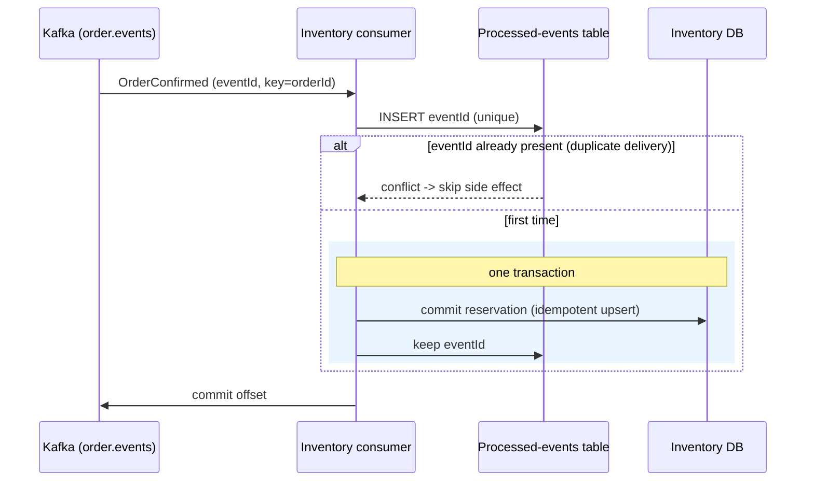

# Order Lifecycle

How an `Order` moves through its states, and the runtime sequences behind the two most
important flows. State is **derived** from the event stream — these diagrams describe the
*projection* of current status, not a mutable status column.

## State model

**Invariants enforced by the aggregate (examples):**

- Cannot `Confirm` without both payment authorization and inventory allocation.
- Cannot `Cancel` lines that have already shipped (only remaining lines are cancellable).
- Cannot `RequestReturn` before `Delivered`.
- A command targeting a stale aggregate version is rejected with a concurrency conflict
  ([ADR 0005](../adr/0005-optimistic-concurrency-control.md)).

These invariants live in the **pure aggregate**, decided against state folded from prior
events — making them exhaustively testable with Given-When-Then unit tests.

---

## Sequence — place & confirm an order (write path + reliable publish)

The client gets a fast, durable acknowledgement the moment the transaction commits.
Publishing to Kafka happens **after** commit, decoupled, and is retried safely because the
outbox row is the durable record of intent.

---

## Sequence — downstream reaction (at-least-once + idempotency)

Because delivery is at-least-once ([ADR 0008](../adr/0008-idempotent-consumers.md)), the
consumer dedupes on `eventId`; a redelivered event is recognized and produces no extra effect.

---

## Replay flows (realizing the "replay" goal)

- **Aggregate replay:** load all events for an `orderId` and fold them → current `Order`.
  This is the normal rehydration path on every command.
- **Projection rebuild:** truncate (or version) a read model and re-fold the entire event
  stream from `sequence_no = 0` → useful after a projection bug fix or a new read model.
- **Point-in-time replay:** fold events up to a chosen `occurredAt`/`sequenceNo` → "what did
  this order look like last Tuesday?" — a tangible demonstration of immutable history's value.
