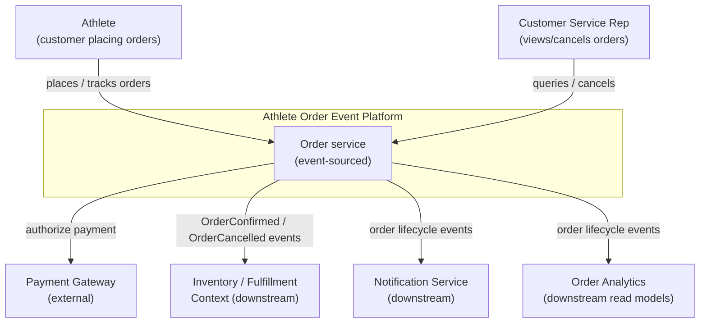
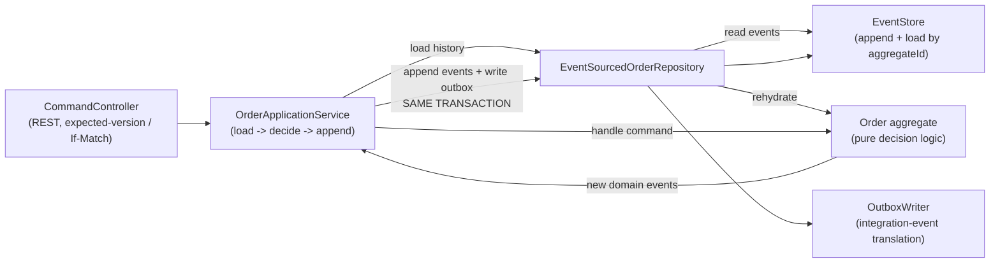

# Architecture Overview

The Athlete Order Event Platform is an **event-sourced**, **event-driven** order management
service. The authoritative state of every order is an immutable, replayable stream of events
in PostgreSQL ([ADR 0001](../adr/0001-postgres-as-authoritative-event-store.md)); other
bounded contexts integrate through versioned events on Kafka, published reliably via a
transactional outbox ([ADR 0002](../adr/0002-transactional-outbox-for-publishing.md)).

This document presents the system in [C4](https://c4model.com/) levels: **Context →
Container → Component**, followed by the runtime write/read paths and the quality attributes
the design optimizes for.

---

## Level 1 — System Context

Who and what the platform interacts with.



**Boundary intent:** the platform owns the *order lifecycle* and nothing else. Inventory,
fulfillment, and notifications are separate contexts that **react to** order events — they are
not called synchronously. This keeps the order service available even when downstream
contexts are degraded.

---

## Level 2 — Container

The deployable/process-level units.

```mermaid
flowchart TB
    client["API clients<br/>(web, mobile, CSR tools)"]

    subgraph svc["order-service (Spring Boot, JVM)"]
        api["REST API<br/>(commands + queries)"]
        domain["Domain core<br/>(Order aggregate, command handlers)"]
        saga["OrderConfirmationSaga<br/>(process manager + stubs)"]
        proj["Projection worker<br/>(builds read models)"]
        relay["Polling relay<br/>(outbox -> Kafka)"]
    end

    subgraph cons["inventory-consumer (Spring Boot, JVM)"]
        listener["Kafka listener<br/>(idempotent)"]
    end

    pg[("PostgreSQL<br/>orders db: event store + outbox + read models")]
    pg2[("PostgreSQL<br/>fulfillment db: inbox + read model")]
    kafka[["Apache Kafka<br/>order.events (keyed by orderId)"]]

    client -->|HTTP/JSON| api
    api --> domain
    domain -->|append events + outbox<br/>(one transaction)| pg
    saga -->|payment + inventory steps| domain
    proj -->|read events / upsert read models| pg
    relay -->|poll undispatched outbox<br/>(FOR UPDATE SKIP LOCKED)| pg
    relay -->|publish Avro events| kafka
    kafka -->|consume| listener
    listener -->|dedupe + upsert| pg2
```

Notes:

- **`order-service`** hosts the API, domain core, confirmation saga, projection worker, and
  polling relay as internal components ([ADR 0010](../adr/0010-module-topology.md)). The
  boundaries are drawn so the relay and projections could be split into separate deployables
  without touching domain code.
- **`inventory-consumer`** is a separate deployable that reacts to the public event contract
  over Kafka, sharing no code with the producer — making the event-driven boundary real.
- **Relay is a polling publisher** in this build; Debezium CDC is the documented production
  upgrade behind the same seam ([ADR 0002](../adr/0002-transactional-outbox-for-publishing.md)).
- **PostgreSQL** holds three logical concerns kept clearly separated: the **event store**
  (truth), the **outbox** (publishing), and **read models / projections** (queries — CQRS).
- **Integration events are Avro**, governed by the Confluent Schema Registry with `BACKWARD`
  compatibility ([ADR 0004](../adr/0004-avro-schema-registry-backward-compat.md)). The relay
  translates the stored outbox envelope to Avro at publish time, so the registry stays out of
  the order transaction.

---

## Level 3 — Component (write path inside the domain core)



The aggregate is **pure**: given prior events and a command, it returns new events (or
rejects the command). It performs no I/O, which is what makes the
[Given-When-Then tests](../../README.md#testing-strategy) trivial and fast.

---

## Runtime paths

**Command (write) path:** `HTTP command → load & rehydrate aggregate → aggregate decides →
append domain events + write outbox row (one Postgres transaction) → relay publishes
integration events to Kafka → idempotent consumers react.`

**Query (read) path:** `HTTP query → read model (projection) table → response.` Read models
are eventually consistent with the event store and are **rebuildable by replay**, which is
how the "replay capability" goal is realized concretely (rebuild a projection from event 0,
or to a point in time).

---

## Quality attributes (what the architecture optimizes for)

| Attribute | How it is achieved |
|-----------|--------------------|
| **Auditability / immutable history** | Append-only event store; nothing is ever updated in place. |
| **Correctness under concurrency** | Optimistic concurrency on `(aggregate_id, sequence_no)` ([ADR 0005](../adr/0005-optimistic-concurrency-control.md)). |
| **No lost events** | Transactional outbox eliminates dual writes ([ADR 0002](../adr/0002-transactional-outbox-for-publishing.md)). |
| **Loose coupling** | Public integration events distinct from internal domain events ([ADR 0003](../adr/0003-separate-domain-and-integration-events.md)). |
| **Safe evolution** | Avro + Schema Registry, BACKWARD compatibility, additive schema changes ([ADR 0004](../adr/0004-avro-schema-registry-backward-compat.md)). |
| **Throughput / scale** | Per-`orderId` partitioning ([ADR 0007](../adr/0007-partition-by-order-id.md)); parallel consumers; read/write separation (CQRS). |
| **Resilience** | At-least-once delivery + idempotent consumers ([ADR 0008](../adr/0008-idempotent-consumers.md)); downstream contexts decoupled. |
| **Observability** | Correlation/causation IDs on every event; Micrometer→Prometheus metrics; structured JSON logs (distributed tracing is a documented next step). |

## High-throughput strategy (and how it will be proven)

The "high-throughput order processing" goal is a **design target**, not yet a measured result.
The strategy: batch event appends, size partition count for peak with headroom, scale consumers
within a consumer group, and keep the write path free of synchronous downstream calls. Phase 5
will run a Gatling/k6 scenario and publish the methodology and real numbers (throughput, p50/p99
latency, consumer lag under load). A believable, reproducible number beats an impressive fictional
one — so until that load test exists, no throughput figure is claimed.
